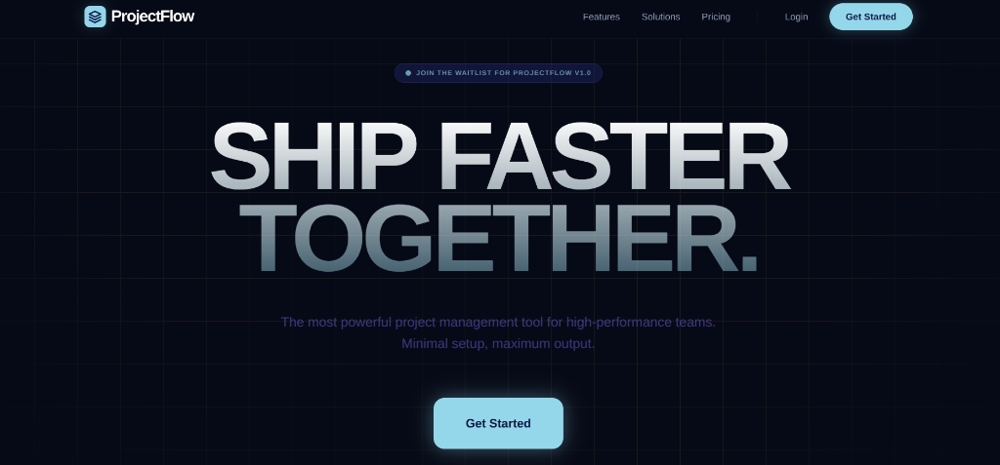
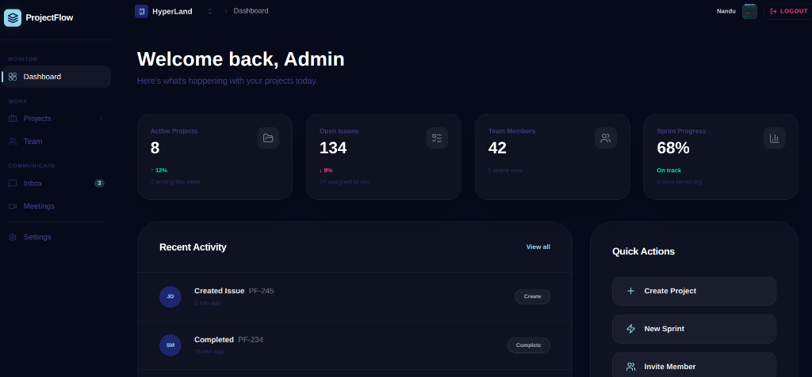

#  ProjectFlow-PMT

<p align="center">
  
</p>

<p align="center">
  <b>The most powerful project management tool for high-performance teams.</b><br>
  <i>Minimal setup, maximum output. Ship faster, together.</i>
</p>

<p align="center">
  
  
  
</p>

---

## 🚀 About the Project

**ProjectFlow** is a next-generation project management platform designed to streamline workflows and enhance team collaboration. Built with a focus on speed, security, and scalability, it provides a seamless experience for managing tasks, tracking progress, and communicating with team members in real-time.

---

## 🚀 Quick Start

Follow these steps to get the project up and running in your local development environment.

### 🛠 Prerequisites

Ensure you have the following installed:
- **Node.js** (v18.x or higher)
- **npm** (v7.x or higher)
- **MongoDB** (Local or Atlas)
- **Redis** (Local or Upstash)

### 📦 Installation

1. **Clone the repository**:
   ```bash
   git clone <repository-url>
   cd ProjectFlow-PMT
   ```

2. **Install dependencies**:
   ```bash
   npm install
   ```

### ⚙️ Environment Setup

You need to configure environment variables for both the client and server.

#### Server
1. Navigate to the `server` directory:
   ```bash
   cd server
   ```
2. Copy the `.env.example` to `.env`:
   ```bash
   cp .env.example .env
   ```
3. Update the `.env` file with your credentials (MongoDB URI, Redis URL, Google OAuth, etc.).

#### Client
1. Navigate to the `client` directory:
   ```bash
   cd ../client
   ```
2. Copy the `.env.example` to `.env`:
   ```bash
   cp .env.example .env
   ```
3. Update the `.env` file if necessary.

### ⚡ Running the Project

From the root directory, you can run both the client and server concurrently:

```bash
# Run both frontend and backend
npm run dev

# Or run them individually
npm run dev:client  # Frontend only
npm run dev:server  # Backend only
```

---

## ✨ Important Features

| Feature | Description |
| :--- | :--- |
| **🔐 Secure Auth** | Multi-layer authentication with Google OAuth, JWT, and bcrypt hashing. |
| **👥 Team Management** | Invite members, manage roles, and track individual contributions. |
| **📊 Real-time Dashboard** | Live updates on project status, task completion, and team activity. |
| **📧 Smart Notifications** | Automated email alerts for invitations, password resets, and updates. |
| **📱 Responsive UI** | Optimized for all devices, from desktop monitor to mobile smartphone. |
| **⚡ High Performance** | Powered by Redis caching and a optimized MongoDB backend. |

---

## 🛠 Tech Stack

### Frontend
- **Framework**: [React 19](https://reactjs.org/)
- **Build Tool**: [Vite](https://vitejs.dev/)
- **Styling**: [Tailwind CSS v4](https://tailwindcss.com/)
- **UI Components**: [Radix UI](https://www.radix-ui.com/)
- **Animations**: [Framer Motion](https://www.framer.com/motion/)
- **State Management**: [Zustand](https://github.com/pmndrs/zustand)
- **Icons**: [Lucide React](https://lucide.dev/)

### Backend
- **Runtime**: [Node.js](https://nodejs.org/)
- **Framework**: [Express 5](https://expressjs.com/)
- **Database**: [MongoDB](https://www.mongodb.com/) (via Mongoose)
- **Caching**: [Redis](https://redis.io/)
- **Validation**: [Zod](https://zod.dev/)
- **Authentication**: [JWT](https://jwt.io/) & [Google OAuth](https://developers.google.com/identity)

---

## 🏗 Architecture

The project follows a **Monorepo** structure with a **Clean Architecture** approach, ensuring separation of concerns and maintainability.


- **Presentation**: REST Controllers, Express Middlewares, and Routes.
- **Application**: Business logic, Use Cases, and Repositories interfaces.
- **Infrastructure**: Database implementations (Mongoose), External Services (Redis, SMTP).
- **Shared**: Common types, Zod schemas, and utility functions shared between Client and Server.

---

## 🖼 Preview

<p align="center">
  
  <br>
  <i>A glimpse into the internal team management dashboard.</i>
</p>

---

## 📊 Summary of Progress

| Component | Status | Description |
| :--- | :---: | :--- |
| **Core API** | ✅ | Express backend with npm workspace. |
| **Auth System** | ✅ | OTP-based registration and secure login. |
| **Workspace** | 🚧 | Multi-tenant workspace management. |
| **Profile** | ✅ | User profiles with Cloudinary image support. |
| **Deployment** | 📝 | CI/CD pipeline and production configuration. |

---

## 🏁 Conclusion

**ProjectFlow-PMT** is more than just a tool; it's a foundation for high-performance teams. By combining a modern modular architecture with the latest web technologies, we've created a platform that is both robust for enterprises and delightful for developers.

As we continue to iterate, our focus remains on performance, user experience, and building the most vertical project management solution in the industry.

---


